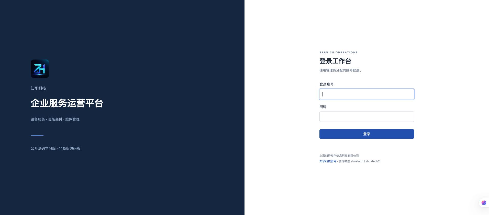
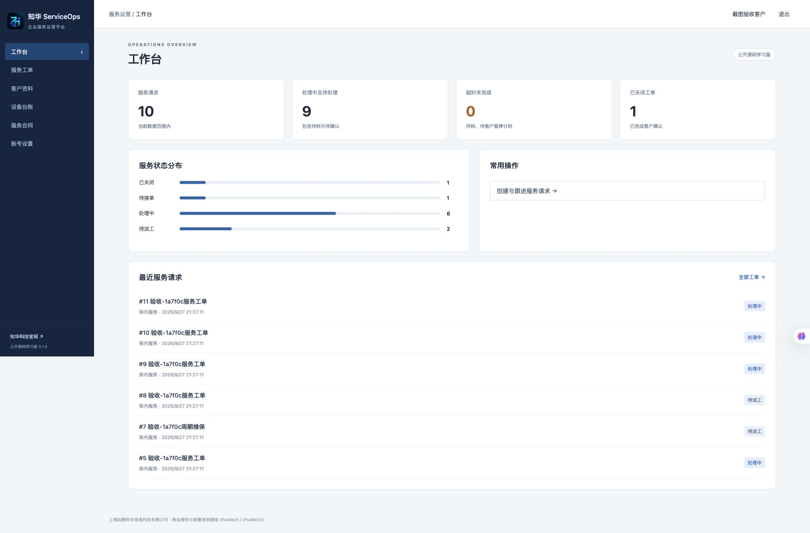
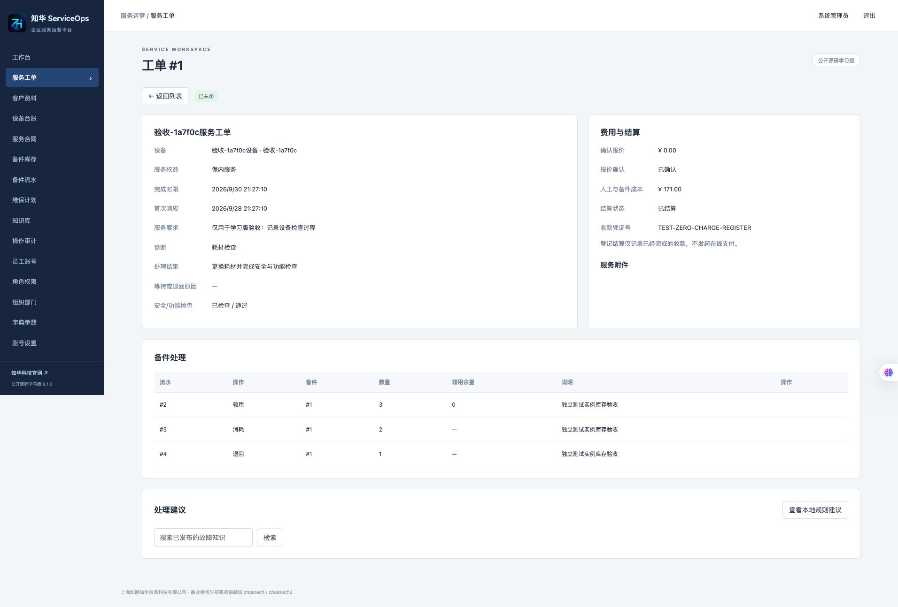
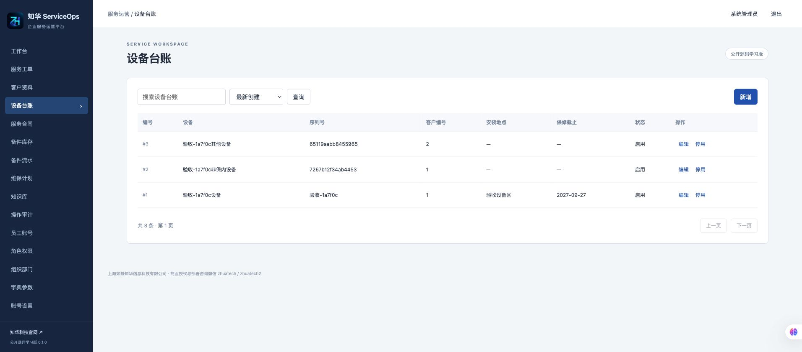
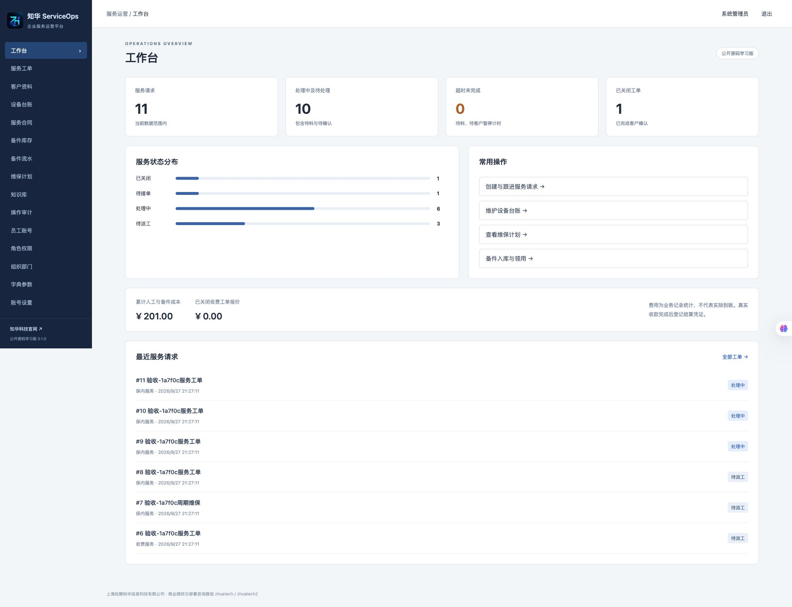
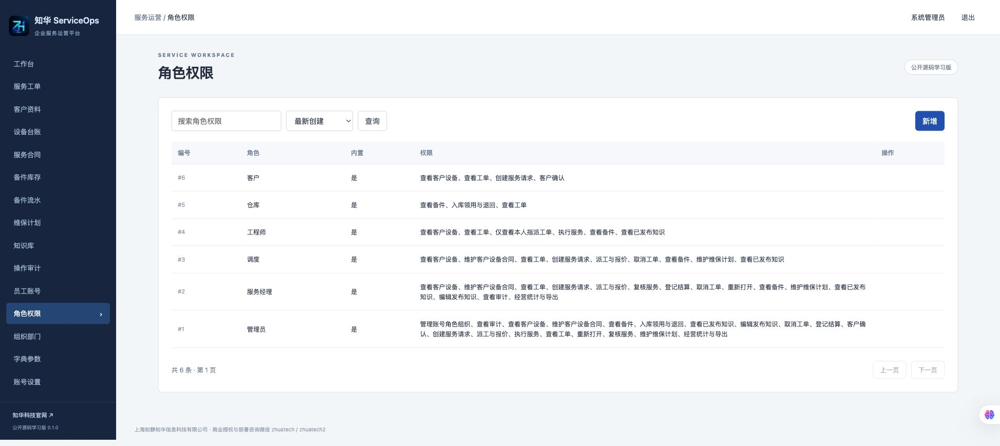

<p></p>

# 知华企业服务运营平台 · ServiceOps

**公开源码学习版 0.1.0｜设备售后与周期维保**

知华科技（上海如静知华信息科技有限公司）提供。官网：[www.zhuatech.cn](https://www.zhuatech.cn/)。

设备服务常常分散在聊天记录、纸质派工单和备件表格中，难以核对服务权益、维修过程、耗材和客户确认。本版把设备建档到服务关闭连接为可操作流程，供设备服务团队、设施维护团队及企业软件学习者研究。

## 从设备建档到服务关闭

```text
客户 → 设备 → 服务合同／保修权益 → 服务请求
                                 ↓
收费报价 → 客户确认报价 → 派工 → 工程师接单
                                 ↓
                        执行／等待备件／等待客户
                                 ↓
                     核销领料 → 完工 → 经理复核
                                 ↓
                       客户确认 → 关闭 → 结算登记

周期维保计划 → 到期生成服务请求（不自动派工）
```

核心约束：报价未确认不能派工；已领备件未消耗或退回不能完工；完工须记录诊断、处理、安全检查和功能验证；客户确认后才能关闭；已结算工单不能重开账单。

### 已实现模块

| 模块 | 实际能力 |
|---|---|
| 客户与设备 | 建档、编辑、停用、搜索、分页；有服务历史的设备不可转移客户 |
| 服务合同 | 设备合同期限、响应与解决时限；创建工单时固化权益与费用参数 |
| 工单 | 收费报价与确认、派工、接单、等待、恢复、完工、复核退回、客户确认、取消、重开与结算登记 |
| 备件 | 主数据、入库、领用、退回、消耗；库存事务加锁、请求幂等、原领用成本快照 |
| 周期维保 | 按日期自动生成及手动触发；每计划每日期唯一；每轮最多追补30期 |
| 服务证据 | PNG/JPEG/PDF签名与大小检查、受工单权限保护的下载 |
| 知识资料 | 发布与撤下、搜索；工程师查询已发布知识及本地规则建议 |
| 账号与权限 | 部门、账号、角色与权限管理；权限控制菜单可见性；BCrypt、会话、CSRF、密码修改及旧会话失效 |
| 资料范围 | 管理员跨部门；员工限所属部门；工程师工单限已指派；客户限绑定客户；客户接口屏蔽内部成本 |
| 字典与参数 | 分类字典维护；部门人工费率、默认响应小时数、默认解决小时数实际用于新工单 |
| 运营与审计 | 当前范围仪表盘、状态统计、超时统计、成本及收费报价统计、操作审计 |
| 导入与导出 | 客户／备件JSON批量事务导入；当前筛选条件的工单CSV导出，最多5000条 |

主数据采用停用而非物理删除，保留服务历史。业务列表支持搜索、分页与创建／更新时间排序；账号管理列表在浏览器分页。部门属于同一部署实例的管理范围，不等同于独立SaaS租户隔离。

### 第一版边界

- **本地建议已实现**：`AdviceAdapter`的本地规则适配器与已发布知识检索。界面明确标识本地规则；不会代替人工派工、审批、报价或扣库存。
- **外部AI未实现**：没有大模型、向量检索或付费调用；不需要模型凭证。统一接口是后续扩展入口。
- **尚未实现**：移动App、微信接单、地图排程、预约日历、技能匹配、离线作业、电子签名、发票、在线支付、会计核算、ERP/WMS/CRM连接器及多实例高可用调度。
- **结算登记**只记录已完成的收款凭证或零收费核销凭证，不验证银行到账。报价不是实际收入，人工费率用于成本记录。
- SLA按连续小时计算，等待备件／客户期间暂停解决时限；时间戳为UTC，页面按浏览器时区显示。日期计划按UTC日期，不包含工作日、节假日或地区日历。
- 会话保存在单个后端内存中，重启后重新登录；自动任务面向单实例。首次空库不自动造业务记录，测试资料由验收工具在独立环境明确生成。

## 实际运行页面

下列页面来自本版实际运行系统；业务资料均为明确标记的验收数据。

| 登录 | 客户业务首页 |
|---|---|
|  |  |

| 服务工单 | 后台设备管理 |
|---|---|
|  |  |

| 运营仪表盘 | 权限管理 |
|---|---|
|  |  |

用户端：客户登录后查看本客户设备及服务请求、创建报修、确认报价和服务结果。后台：管理员维护账号权限与资料；调度派工；工程师填写过程与上传证据；仓库登记库存；经理复核与结算。详见[操作手册](docs/操作手册.md)。

## 架构与工程

浏览器 → Nginx同源页面与`/api`代理 → Spring Security会话认证 → 业务权限与数据范围 → JPA事务 → MySQL。附件独立卷持久化。Flyway负责建表与版本升级，应用仅校验结构，不自动更新结构。

| 层 | 版本 |
|---|---|
| 后端 | Java 21、Spring Boot 4.0.7、Spring Security、Spring Data JPA、Flyway、MariaDB Connector/J 3.5.10（连接MySQL） |
| 前端 | Vue 3.5.40、Vue Router 5.2.0、Vite 8.1.5、JavaScript |
| 构建 | Maven 3.9、Node.js 24.19.0、npm锁定依赖 |
| 基础设施 | MySQL 8.4、Docker Compose v2、Nginx 1.29 |
| 验收工具 | Python 3.11以上（仅标准库） |

```text
backend/src/main/java/cn/zhuatech/serviceops/  权限、状态、库存、维保等业务
backend/src/main/resources/db/migration/     Flyway迁移
backend/src/test/                            单元及集成测试
frontend/src/                               Vue操作页面
frontend/public/brand/                      正式Logo与两个微信二维码
frontend/nginx.conf                         同源代理与SPA回退
scripts/                                   配置生成、HTTP验收与发布核查
docs/                                      接口、架构、部署和操作文档
compose.yaml                               完整学习环境
```

## 快速启动

安装Docker和Compose v2。首次启动前生成随机密码：

```bash
python3 scripts/init-env.py
docker compose config --quiet
docker compose up -d --build --wait --wait-timeout 240
```

打开 **http://127.0.0.1:8198**，健康检查 **http://127.0.0.1:8198/health**。

首次账号：`admin`。密码是本机`.env`中的`SERVICEOPS_ADMIN_PASSWORD`，没有共享默认密码。脚本生成24字节随机值且拒绝覆盖已有配置；`.env`已忽略并只允许当前用户读取。登录后在“账号与关于”修改个人密码。仅空库初始化管理员；修改环境变量不会重设已有账号。

### 环境变量

| 字段 | 用途 |
|---|---|
| `DB_PASSWORD` | MySQL业务账号密码，必填 |
| `MYSQL_ROOT_PASSWORD` | MySQL管理密码，必填 |
| `SERVICEOPS_ADMIN_PASSWORD` | 空库初始化密码，至少12位，必填 |
| `WEB_BIND` | 默认`127.0.0.1`，学习环境只开放本机 |
| `WEB_PORT` | 默认`8198`，可改以避免多项目端口冲突 |
| `SESSION_SECURE` | 默认`false`用于本机HTTP；HTTPS对外部署设`true` |

`.env.example`仅提供字段名与说明。数据库和后端端口不向宿主机开放。覆盖端口示例：`WEB_PORT=8298 docker compose up -d`；健康地址同步改为8298。已有数据库卷中的账号密码不会因改`.env`自动变化。

### 本地开发

需要Java21、Maven3.9、Node24.19及独立MySQL8.4。建立`zhuatech_serviceops`库，JDBC使用`jdbc:mariadb://localhost:3306/zhuatech_serviceops`连接MySQL，并向后端环境注入`DB_URL`、`DB_USERNAME`、`DB_PASSWORD`、`SERVICEOPS_ADMIN_PASSWORD`和可写`SERVICEOPS_FILES`路径：

```bash
cd backend
mvn spotless:check test
mvn spring-boot:run
```

另一个终端：

```bash
cd frontend
npm ci
npm run dev
```

开发前端默认http://127.0.0.1:5173，通过Vite代理到本机8080后端；容器正式页面通过服务名代理，不依赖宿主机后端地址。

## 数据库与升级

脚本：[V1__service_operations.sql](backend/src/main/resources/db/migration/V1__service_operations.sql)。共14张业务表：组织、角色、账号、客户、设备、合同、工单、备件、库存流水、维保计划、知识、审计、字典参数和附件；另有Flyway历史表。包含关联外键、乐观版本、非负库存约束及流水／计划幂等唯一键。

首次初始化：一个部门、六个内置角色、管理员、三项故障分类和三项费用／时限参数，不包含客户资料或库存。数据持久化在`mysql_data`和`service_files`卷，部署升级不得删除卷。先备份数据库与附件，再更换镜像并启动；新迁移仅新增`V2__...`等文件，不改已发布迁移。恢复与完整步骤见[部署与升级](docs/部署与升级.md)。

## 验证方法

```bash
# backend目录
mvn spotless:check test
# frontend目录
npm run format:check
npm run lint
npm test
npm run build
# 根目录
docker compose config --quiet
docker compose build
python3 scripts/release-check.py
```

HTTP验收会创建明确标记的业务测试资料，**只对独立本机测试实例运行**：

```bash
docker compose -p serviceops-qa up -d --build --wait --wait-timeout 240
python3 scripts/smoke.py --allow-test-data
docker compose -p serviceops-qa down -v
```

最后一条只用于销毁这个独立验收实例及其测试卷；实际学习数据环境使用`docker compose down`保留卷。首次启动、完整流程、权限、并发库存、导入回滚与迁移检查详见[测试与验收](docs/测试与验收.md)。

## 安全与常见故障

会话Cookie使用HttpOnly、SameSite=Lax；所有写接口含CSRF检查；SQL参数绑定；资料按部门、客户和指派限制；库存行锁与唯一键防止超卖和重复扣减；密码散列与附件存储名不输出到业务API。文件限5MB、PNG/JPEG/PDF签名，作为下载附件返回；签名检查不等于恶意文件扫描。

对外部署需要书面商业授权及独立安全评估，配置HTTPS、`SESSION_SECURE=true`、网关限流、网络隔离、最小权限、日志保护、备份与恢复演练。本版没有MFA、验证码、分布式会话、病毒扫描和专用登录限流。不要将真实客户或生产数据放入公开源码库、测试日志或截图。

| 现象 | 检查 |
|---|---|
| 缺少环境变量、拒绝启动 | 运行配置生成脚本，核对`.env`字段 |
| 端口占用 | 调整`WEB_PORT`，保留其他项目服务 |
| 数据库未健康 | `docker compose logs db`；已有卷须使用原数据库密码 |
| 后端未健康 | `docker compose logs backend`；核对迁移、数据库与管理员密码长度 |
| 修改环境密码后登录失败 | 初始化只执行一次；通过账号管理修改已有账号 |
| HTTP部署无法保持登录 | 本机HTTP保持`SESSION_SECURE=false`；HTTPS部署设`true` |
| 409版本冲突 | 刷新记录重新操作，勿覆盖其他人的更新 |
| 备件不能完工 | 消耗实际使用数量，退回剩余领用数量 |
| 附件记录在但文件缺失 | 核对附件卷恢复；数据库与文件必须配套备份 |
| 构建下载失败 | 检查网络后重试；后端构建包含依赖缓存与重试，测试不能跳过 |

## 授权、贡献与支持

自有代码适用根目录[LICENSE](LICENSE)“知华科技公开源码学习许可1.0”，仅限个人学习、技术研究和非商业交流；未经上海如静知华信息科技有限公司书面授权不得商用，不是OSI标准开源许可证。第三方库保留其自身许可证，见[第三方说明](docs/第三方说明.md)。品牌联系方式不改变第三方授权。

欢迎提交可复现问题与小范围改进，说明环境、复现步骤和检查结果；贡献者须有提交代码的权利，并同意贡献适用本项目许可。不得提交真实凭证或客户数据。普通问题可通过代码平台Issue反馈；安全漏洞请通过下方咨询微信私下联系，勿在公开Issue发布利用细节或敏感资料。本版不承诺适用于任何生产业务，使用前自行验证并遵守LICENSE。

## 联系知华科技

本项目由知华科技（上海如静知华信息科技有限公司）提供公开源码学习版本，主要用于个人学习、技术研究与非商业交流。未经书面授权不得商用。企业信息化建设、中小企业数字化转型、中小企业 AI 转型、私有化部署、软件外包、软件项目外包、软件实施、FDE 外包、OPC 技术支持及深度定制开发，请访问知华科技官网 https://www.zhuatech.cn/，或添加微信 zhuatech、zhuatech2 咨询。

<table><tr><td align="center"><br>微信：zhuatech</td><td align="center"><br>微信：zhuatech2</td></tr></table>
